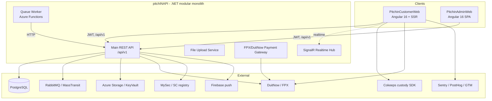

# pitchIN Platform — Architecture Overview

> **Audience:** CTO review + downstream AI agents planning build/improvement work.
> **Scope:** The three repositories under `ai/` — `pitchINAPI` (backend), `PitchinAdminWeb`, `PitchinCustomerWeb`.
> **Basis:** Structural code graph (graphify, 30,549 nodes / 62,242 edges across 4,093 production code files) + direct source review. Vendored libraries, build output, tests, and config were excluded from the graph.
> **Companion:** `AI_QUERY_GUIDE.md` explains how an AI should query this codebase cheaply instead of reading it whole.

---

## 1. System at a glance

pitchIN is a Malaysian **equity crowdfunding (ECF)** platform and **digital share registry**, plus a **secondary market** ("MySec") for trading shares post-investment. Three deployables make up the product:

| System | Repo | Tech | Role |
|---|---|---|---|
| **Backend API** | `pitchINAPI` | .NET / ASP.NET Core, EF Core + PostgreSQL | All business logic, data, payments, registry, messaging |
| **Admin Web** | `PitchinAdminWeb` | Angular 16 (SPA) | Back-office: campaign/issuer/investor management, registry, approvals, audit |
| **Customer Web** | `PitchinCustomerWeb` | Angular 16 + SSR (Universal) | Public: browse/invest in campaigns, portfolio, wallet, payments, KYC, secondary market |

**Key fact for planners:** the two frontends are **independent Angular apps that share no code** (confirmed in the graph — there are zero genuine cross-repo edges). They integrate only through the backend's versioned HTTP API. They *do* duplicate concepts (models like `Campaign`, `Attachment`, `LoginProfile`; services like `CampaignService`, `InvestmentService`) in parallel — a deliberate target for a future shared library.

---

## 2. Backend — `pitchINAPI`

### Shape
A **modular monolith** in .NET, organized into clear layers (evidence: `PitchIn.sln`, directory layout):

| Layer | Dir | Owns |
|---|---|---|
| **Presentation** | `Presentation/` | 4 deployable hosts: main API, file upload, FPX/DuitNow gateway, SignalR hub |
| **Modules** | `Modules/` | Domain bounded contexts (Campaign, Investment, Authentication, Payment, RaiseFund, Company, DigitalRegistry, Notification, AuditTrail, + 9 `MySec.*` modules). Each: `Domains/ Services/ Dtos/ Validators/ Mappings/` |
| **BaseModules** | `BaseModules/` | Cross-cutting reusable services: Jwt, Email, Storage, Cache, Queue, Firebase, PaymentGateway, PDF, Hangfire, CtosReport (credit bureau), NemBlockchain, Attachments |
| **Databases** | `Databases/` | `PitchInDbContext` (EF Core), Repository/UnitOfWork, soft-delete query filter |
| **Commons** | `Commons/` | `ServiceResponse<T>`, `PagedList<T>`, error messages, filter bases |
| **Queue** | `Queue/` | Standalone Azure Functions order-processing worker (calls API over HTTP) |

### Stack (from README + project files)
.NET / ASP.NET Core · EF Core + **PostgreSQL** (Npgsql) · **AutoMapper** · **FluentValidation** · **MassTransit + RabbitMQ** (async audit/order events) · **Hangfire** (jobs) · **SignalR** (realtime) · **Firebase Admin** (push) · **NPOI** (Excel) · **MailKit/MailChimp** · **NLog** · **Azure Storage/KeyVault** · **Swashbuckle/Swagger** · ASP.NET Identity + custom JWT.

### API contract (what the frontends depend on)
- **Versioned routes** `/api/v1/...`, split by audience (`Admin/`, `SuperAdmin/`, public/`Customer/`).
- **JWT bearer**, role-based `[Authorize(Roles=...)]`.
- **DTO convention** `{Resource}{Action}Request` / `{Resource}{Action}Response`; responses wrapped in `ServiceResponse<T>`; lists in `PagedList<T>`.
- Rich domain enums (`InvestmentStatus`, `ShareAllotmentStatus`, …).

### External integrations
DuitNow/FPX payments · MySec (Securities Commission registry, 9 modules) · CTOS (credit/KYC) · Firebase · MailKit/MailChimp · Prismic CMS · NEM blockchain (share records) · Zendesk/Slack/ClickUp ops · Azure (storage, tables, queues, KeyVault) · Application Insights.

---

## 3. Admin Web — `PitchinAdminWeb`

- **Angular 16.2** SPA, hash routing, **no SSR**, **no NgRx** (service + RxJS state). Material + ng-bootstrap + Bootstrap 4 + Tailwind (`tw-` prefix). Charts via chart.js. CKEditor 5. i18n via ngx-translate.
- **Structure:** `core/` (33 API services, 236 models, 140+ enums, guards, interceptors) · `layouts/` (AdminLayout + AuthLayout) · `pages/` (~35 flat feature areas, registered inline in `admin-layout.routing.ts`) · `shared/` (components, directives, pipes, interceptors).
- **Backend integration:** `core/services/api/*.service.ts`; `AccessTokenInterceptor` injects JWT and substitutes `{role}` into the URL; base URL from `environment.apiServer`.
- **Feature areas:** Issuer/Campaign management, Individual & Corporate Investors, Investment management + EDD, Digital Registry, Market/Orders, Approvals & Compliance, Audit & Activities, Admin Users & Settings, Wallet/Fees, Forms/Documents.

---

## 4. Customer Web — `PitchinCustomerWeb`

- **Angular 16.2 + Angular Universal SSR** (`server.ts`, Express, Domino, TransferState, per-route CSP/security headers). Custom webpack (moment locales). Material (legacy modules) + Bootstrap 4 + Tailwind. Swiper, chart.js.
- **Structure:** `core/` (~50 API services incl. `api/mysec/*`, 30+ model dirs, 80+ enums, auth/2FA, encrypt, storage) · `shared/` · `layouts/` (3 lazy-loaded: investor-dashboard, mysec, profile) · `pages/` (~32, mostly **eagerly loaded** — bundle-size risk).
- **Backend integration:** same JWT + `{role}` interceptor pattern; base `environment.apiServer`; 7 environment files.
- **Feature areas:** Campaign browse/invest (ECF + TCF), Portfolio, Payment (FPX/DuitNow), Wallet (MySec), Raise/fundraising, Auth/Signup/eKYC, Secondary market, Academy/Learn, Announcements, AI Chatbot.
- **External:** **Cokeeps SDK** (custody wallet) · Sentry · **Gemini** (campaign image generation) · Firebase · SignalR (`ctosHub`, `marketsHub`) · Prismic · PostHog · GTM.

---

## 5. Module map (from the graph)

The clean graph splits into ~50 meaningful modules (communities ≥20 nodes). The largest, named:

| Module | System | What it groups |
|---|---|---|
| Campaign, Academy & Public Site | Customer | Public campaign browse + CampaignService + content pages |
| Wallet, Team & Account Services | Customer | Account/company/partnership/wallet services |
| Auth/Signup Models & AI Chatbot | Customer | Login/signup models, eKYC, chatbot modal |
| Portfolio & Business Directory | Customer | Holdings, business listings |
| Investment & TCF Campaign | Customer | Investment + TCF flows |
| Payment (DuitNow) | Customer | Payment + DuitNow components |
| Shared UI Components | Customer | Accordion/alert/button/etc. |
| Settings, Users & Campaign Services | Admin | Admin settings + core campaign/issuer/raise services |
| Digital Registry & Shareholders | Admin | Registry, shareholder/attachment models |
| Campaign & Investment Services | Admin | Campaign/investment/checklist services |
| Market, Orders & Due Diligence | Admin | Market/order/RSS/DD services |
| Audit Trail & Approvals | Admin | Audit + approval flows |
| Business Fees, EDD & Reports | Admin | Fees, EDD, reports |
| Investment Service | API | Investment DTOs + `IInvestmentService` |
| Secondary Market (MySec) Orders | API | MySec orders, matching |
| MySec Company & Announcements | API | MySec controllers/requests |
| Campaign/Raise Admin Request DTOs | API | Admin request/response DTOs |

Full, queryable list lives in `graphify-out/GRAPH_REPORT.md` and the interactive `graphify-out/graph.html`.

---

## 6. Architecture health (graph-derived signals)

- **God objects / hotspots.** The most-connected nodes are cross-cutting services — `ErrorService`, `BlockUiService`, `PopupService` (shared infra, expected) — and, more notably, **fat domain services**: backend `CampaignService` (~67 injected dependencies), Admin `campaign.service.ts` (~1,084 LOC), `digital-registry.service.ts` (~569 LOC); Customer `AccountService` and `AppComponent` (~589 LOC, 18 injected services). These are the highest-value decomposition targets.
- **Coupling.** Backend modules are tightly interlinked (Campaign ↔ RaiseFund ↔ Investment ↔ Company ↔ Notification). Frontends couple components directly to many services (no facade layer).
- **Import cycles.** None detected in the structural graph.
- **Duplication across frontends.** Parallel models/services in both Angular apps with no shared package.
- **Tests.** Backend has integration test projects; both frontends have `.spec.ts`/Cypress present but **no active unit-test runner** (`"test": ""` in both `package.json`). Effective unit coverage ≈ 0.

---

## 7. AI-native readiness

**What already helps an AI work here:**
- Consistent, domain-driven naming (`I{X}Service`, `{Resource}{Action}Request`, `*.service.ts`, `*.component.ts`).
- Stable, predictable layering (backend modules; frontend core/shared/pages).
- Rich typed enums and models make domain vocabulary discoverable.
- A versioned, role-segmented API contract is a clean seam between systems.
- This structural graph + `graphify query` give an AI **cheap, targeted retrieval** (see `AI_QUERY_GUIDE.md`).

**What blocks AI-assisted change (prioritized):**

| # | Barrier | Why it hurts AI work | Suggested move |
|---|---|---|---|
| 1 | **No test safety net** (both FE runners disabled; thin unit coverage) | AI can't self-verify refactors | Stand up Jest/Karma; add characterization tests around god services first |
| 2 | **God services** (CampaignService BE/FE, AccountService, AppComponent) | Huge context to load; risky edits; high blast radius | Extract facades / split by sub-domain; document responsibilities |
| 3 | **No shared FE library** (duplicated models/services) | Same change must be made twice, inconsistently | Extract a shared `@pitchin/*` lib for models, enums, API clients |
| 4 | **Frontend state in scattered RxJS/BehaviorSubjects** | Data-flow hard to trace/predict | Consolidate into a documented state pattern (signals/NgRx for trading-critical flows) |
| 5 | **Customer Web eager-loads ~32 pages** | Large bundles; unclear module boundaries | Lazy-load feature routes; define feature modules |
| 6 | **`Observable<any>` in some FE services; loose DTO typing** | AI loses type signal | Generate typed API clients from the backend OpenAPI/Swagger |
| 7 | **Backend startup config sprawl** (20+ settings classes, no validation) | Hard to reason about runtime requirements | Add options validation; document required config per environment |

**Highest-leverage AI-native step:** the backend already emits **Swagger/OpenAPI**. Generating typed API clients from it would (a) give both frontends a single typed contract, (b) eliminate the duplicated/loose service layer, and (c) give AI agents a machine-readable spec to plan against — directly attacking barriers #3 and #6.

---

## 8. How this documentation is meant to be used

- **Humans / CTO:** read this file top-to-bottom; drill into `graphify-out/GRAPH_REPORT.md` or open `graphify-out/graph.html` for the visual module map.
- **AI agents:** read §1, §6, §7 for orientation, then **query the graph** for specifics instead of ingesting source. See `AI_QUERY_GUIDE.md`. This keeps token cost bounded.

> **Caveat:** the graph is **structural (AST) only** — it captures classes, files, and reference/inheritance/containment edges, not runtime behavior or semantic intent. Treat god-node and coupling signals as strong hints, not proof; confirm specifics by querying or reading the cited files.
